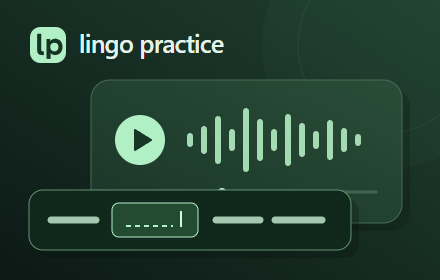

# Lingo Practice

[](LICENSE)

[English](README.md) · Русский · [Скачать](https://github.com/Doomdail/lingo-practice/releases) · [Сообщить об ошибке](https://github.com/Doomdail/lingo-practice/issues)

Тренируйте аудирование на видео YouTube: вписывайте пропущенные слова, повторяйте фразы и возвращайтесь к трудным местам. Прогресс остаётся на вашем устройстве.



## Возможности

- Задания из субтитров YouTube, штатной расшифровки или локального файла SRT/VTT.
- Три подсказки: первая буква, повтор на скорости 0,75× и раскрытие слова.
- Отдельный учёт самостоятельных ответов, помощи, раскрытых слов и пропусков.
- Повтор строки, автопауза и разбор ошибок без изменения основной оценки.
- Настройка сложности, сдвига субтитров, размеров видео и текста, количества строк.
- Локальный прогресс для каждого видео с защитой от перезаписи из другой вкладки.
- Русский и английский интерфейс с автоматическим и ручным выбором.

Для работы не нужны регистрация, API-ключ, сервер, сборка или дополнительные библиотеки.

## Установка

1. Скачайте ZIP из [Releases](https://github.com/Doomdail/lingo-practice/releases) или выберите **Code → Download ZIP** на странице репозитория.
2. Распакуйте архив в постоянную папку. Найдите внутри папку с `manifest.json`: архив исходников может содержать дополнительный внешний каталог.
3. Откройте `chrome://extensions`, `opera://extensions` или `edge://extensions` и включите **Режим разработчика**.
4. Нажмите **Загрузить распакованное расширение** и выберите папку, в которой находится `manifest.json`.
5. Откройте обычное видео на `https://www.youtube.com/watch?...`, дождитесь проигрывателя и нажмите значок Lingo Practice. Для удобства закрепите его через меню расширений браузера.

Для обновления замените файлы в той же установленной папке, нажмите **Обновить** на карточке расширения и перезагрузите вкладку YouTube. Нужны `manifest.json`, все скрипты, `_locales` и `icons`. После установки пакета 0.3.1 на карточке должна появиться версия **0.3.1**. Удаление расширения стирает его локальный прогресс; для обычного обновления удалять его не нужно.

## Тренировка

### Ответы и воспроизведение

Видео находится сверху, прокручиваемые строки — ниже. В речевом фрагменте выбирается одно слово для пропуска. Введите ответ и нажмите **Enter** или **NumPad Enter**. Регистр, пробелы по краям и типографские апострофы не мешают проверке. Неверный ответ можно исправить. **Пропустить** раскрывает слово и отмечает пропуск.

**↶ Повторить строку** или её временная отметка запускает фрагмент сначала. **К текущей строке** возвращает список к позиции видео. Пока поле ответа в фокусе, автоматическая прокрутка не мешает вводу. **Пауза в конце строки** останавливает видео, если ответ ещё не завершён; по умолчанию она выключена.

Во время тренировки цифровой блок не перематывает ролик после клика по проигрывателю. В полях работают цифры, NumPad Enter и редактирование при выключенном NumLock. **Выйти** или повторное нажатие значка восстанавливает страницу и горячие клавиши YouTube. При переходе на другой ролик учебный режим закрывается: нажмите значок снова, чтобы начать занятие на новом видео.

### Подсказки и разбор

Первое нажатие на подсказку показывает первую букву, второе повторяет фрагмент на скорости **0,75×**, третье раскрывает ответ. Прежняя скорость возвращается после окончания замедленного повтора, паузы или выхода из тренировки.

Главный счётчик показывает **самостоятельные правильные ответы / всего заданий**. Ответы с подсказкой, раскрытые слова, пропуски и оставшиеся задания перечислены отдельно в **Разборе ошибок** и при наведении на счётчик. Исправленный ответ без подсказок считается самостоятельным, а допущенная ошибка остаётся в разборе.

**Разбор ошибок** показывает слова, исходные фразы и количество ошибок и подсказок. После окончания видео или субтитров туда добавляются задания без ответа. Можно прослушать отдельный фрагмент или нажать **Повторить сложные места**. Отдельная очередь повтора проходит выбранные фрагменты и ждёт завершения ответа в конце каждого. **К основной тренировке** возвращает исходные ответы и прежнюю позицию видео. Результаты повтора не перезаписывают основную оценку.

### Настройки и языки

В **Настройки → Язык интерфейса** доступны русский, английский и язык браузера. Автоматический режим использует русский для локалей `ru`, английский — для остальных. Переключение сохраняет ответы, черновики, подсказки и позицию видео. Язык субтитров выбирается отдельно.

Можно выбрать три размера видео, текст от **14 до 26 px** и область на **3–7 строк**. На небольшом экране или при переносе длинных фраз видимых строк может быть меньше выбранного числа. Список, настройки и разбор прокручиваются.

Сложность **Лёгкая / Обычная / Сложная** использует длину слова и небольшой список частых английских слов. Это эвристика выбора пропуска, а не оценка уровня CEFR. Лёгкий режим чаще скрывает короткие и частые слова, обычный предпочитает содержательные, сложный — более длинные. Изменение затрагивает только ещё не начатые задания.

Сдвиг субтитров задаётся от **−30 до +30 секунд** с шагом 0,1. **Плюс задерживает субтитры, минус показывает раньше**: `+1,5` сдвигает их на полторы секунды позже. Повтор фрагментов и автопауза используют тот же сдвиг.

## Источники субтитров

**Автоматически** сначала пробует английскую дорожку, предпочитая авторскую автоматической, затем первую доступную. При недоступности прямого текста используется штатная расшифровка YouTube. Отдельный язык в списке выбирает именно эту дорожку; если её не удалось загрузить, появляется ошибка.

**Расшифровка YouTube** использует текущий язык штатной панели. В некоторых вариантах интерфейса время округлено до секунд, а конец строки определяется по следующей отметке. В таком случае синхронизация и автопауза приблизительные; предупреждение видно под кнопками.

Если текст не загрузился, выйдите из режима, раскройте описание видео, нажмите **Показать текст видео** и дождитесь текста. Затем снова включите расширение и выберите **Расшифровка YouTube**. Можно также импортировать файл.

**Открыть SRT/VTT** принимает локальный `.srt` или `.vtt` в UTF-8 со следующими ограничениями:

- **2 МБ — 2 000 000 байт**.
- До **5000 фрагментов** и **2000 символов** текста в одном фрагменте.
- Фрагменты с одинаковым временем начала объединяются, до **4000 символов**.
- Таймкоды должны содержать миллисекунды; конец должен быть позже начала.

Форматирование удаляется, многострочный текст объединяется. При ошибке импорта текущие задания сохраняются. Успешная смена источника начинает новую тренировку для этого видео и сбрасывает сдвиг. Расширение читает импортированный файл локально и никуда его не загружает.

## Прогресс и конфиденциальность

В `chrome.storage.local` текущего профиля браузера сохраняются настройки и одна тренировка для каждого видео: текст субтитров, выбранные пропуски, ответы, ошибки, подсказки, источник, сдвиг и позиция воспроизведения. Импортированный текст восстанавливается без повторного выбора файла.

Статус сохранения виден внизу. Если другая вкладка записала более свежий прогресс, закройте учебный режим в устаревшей вкладке и откройте снова. Ошибки хранилища показываются пользователю. Старые занятия автоматически не удаляются, синхронизации между устройствами нет.

`activeTab` и `scripting` дают доступ к текущей вкладке после нажатия значка; `storage` хранит прогресс локально. Аналитики и собственного сервера у расширения нет. Запросы субтитров идут в YouTube в контексте открытой страницы; обычное воспроизведение и сетевые запросы самого YouTube продолжаются.

Удаление расширения стирает сохранённые им локальные данные. Выход из тренировки и простое отключение расширения их не удаляют. Подробности — в [политике конфиденциальности](PRIVACY.md).

## Совместимость

Основные сценарии, в том числе на реальном видео YouTube, проверены в **Chromium на Windows**. Клавиатура и переключение языков также проверены в **Opera GX 135.0.5973.94**. Edge отдельно не проверен. Предусмотрены широкий и компактный макеты, включая окна 1440×1050 и 780×800.

Shorts, прямые эфиры, мобильный YouTube, другие видеосайты и полноэкранный учебный режим не поддерживаются. Во время рекламы отслеживание заданий приостанавливается, но все варианты рекламы не проверены. Доступность и точность субтитров зависят от YouTube и конкретного видео. Сложность ориентирована на английский; специальной сегментации китайского и японского нет.

## Разработка

Проверки логики выполнялись с **Node.js 22**. Из папки репозитория:

```powershell
node --test tests/exercise.test.cjs tests/storage.test.cjs tests/i18n.test.cjs
```

Для браузерных проверок дополнительно нужны **Playwright** и Chromium. Это инструменты разработки; для установки и использования расширения они не нужны. Модуль `playwright` должен быть доступен локально или через `NODE_PATH`. При необходимости укажите путь к Chromium в `PLAYWRIGHT_CHROMIUM_EXECUTABLE_PATH`.

```powershell
node tests/browser-smoke.cjs
node tests/browser-smoke.cjs --upgrade
node tests/browser-smoke.cjs --storage
node tests/browser-smoke.cjs --i18n
node tests/keyboard-smoke.cjs
node tests/browser-smoke.cjs '--live=https://www.youtube.com/watch?v=jNQXAC9IVRw'
```

Обычный сценарий проверяет базовую тренировку и восстановление страницы. `--upgrade` проверяет импорт, настройки, подсказки, сохранение и разбор; `--storage` — конфликт между вкладками; `--i18n` — выбор языка. Проверка клавиатуры отправляет события цифрового блока, включая редактирование при выключенном NumLock. `--live` открывает настоящий YouTube и требует сети и доступных субтитров.

Браузерные проверки запускают временную копию расширения с доступом к YouTube для имитации нажатия значка. Рабочий `manifest.json` не меняется. Снимки экрана сохраняются в `output/playwright`.

### Упаковка

В Windows требуется **PowerShell 5 или новее**:

```powershell
powershell -NoProfile -File scripts/package.ps1
```

Скрипт читает версию из `manifest.json` и создаёт рядом с папкой репозитория два ZIP: `lingo-practice-<version>.zip` с исходниками и документацией и `lingo-practice-<version>-store.zip` с установочными файлами и `manifest.json` в корне архива. Для каждого файла внутри архивов проверяется SHA-256.

Для проверки распакованного пакета задайте `LINGO_EXTENSION_ROOT` до его папки и запустите браузерный сценарий из исходного репозитория. Иконки и промо из SVG можно пересоздать командой `node scripts/render-assets.cjs` с тем же окружением Playwright.

## Поддержка и лицензия

Сообщения об ошибках и предложения принимаются через [GitHub Issues](https://github.com/Doomdail/lingo-practice/issues). Укажите версию браузера, шаги воспроизведения и текст ошибки, если он есть.

Автор — [doomdail](https://github.com/Doomdail). Проект распространяется по [лицензии MIT](LICENSE).
